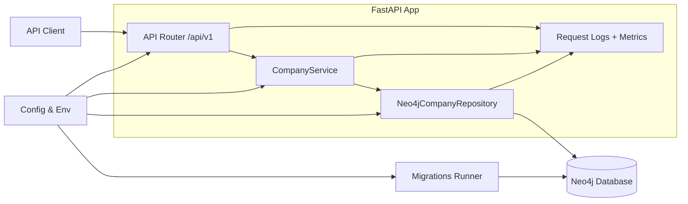
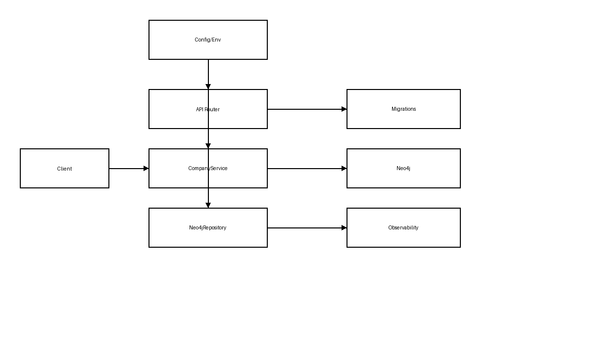

# Architecture

## Overview
This service is a production-style graph backend built on FastAPI with a Neo4j data store. It exposes a small API surface, but the internal design mirrors real systems: explicit service and repository layers, bounded graph traversals, idempotent migrations, and request-scoped observability.

## Diagram (Mermaid)

## Diagram (PNG)

## Component responsibilities
- **API Router**: HTTP validation, status codes, and request/response models.
- **CompanyService**: Orchestrates business rules like bounded risk analysis and parameter defaults.
- **Neo4jCompanyRepository**: Executes Cypher queries and maps graph results into response models.
- **Migrations Runner**: Applies idempotent schema constraints and records migrations inside the graph.
- **Observability**: Request-ID based structured logs plus minimal counters for HTTP and graph usage.

## Runtime flow
1. FastAPI validates input and builds a request context with a request ID.
2. Service layer validates existence and chooses safe defaults (e.g., risk path limits).
3. Repository layer runs bounded Cypher queries and maps results to response models.
4. Neo4j returns paths, node labels, and relationship types for explainable risk output.

## Deployment notes
- Run behind a reverse proxy (TLS termination) with `uvicorn` workers.
- Use environment variables for database routing (`NEO4J_URI`, `NEO4J_USER`, `NEO4J_PASSWORD`, `NEO4J_DATABASE`).
- Maintain separate Neo4j clusters for staging/production with the same migrations.
