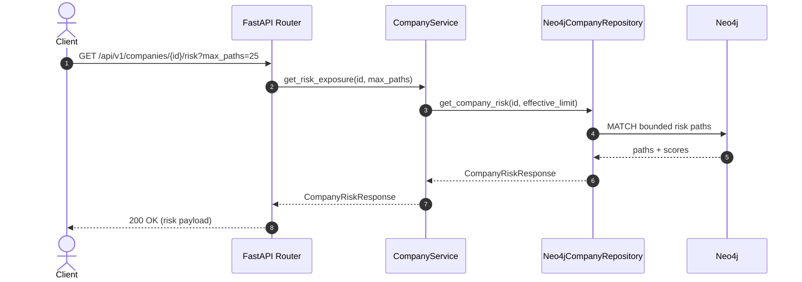

# Risk Analysis

## Risk model
The risk endpoint returns explainable paths and an aggregate exposure score. Each path has an explicit pattern and weight:

| Path pattern | Weight | Rationale |
| --- | --- | --- |
| `Threat → TARGETS → Company` | 1.0 | Direct targeting of the company. |
| `Threat → TARGETS → Domain ← USES ← Employee → WORKS_FOR → Company` | 0.7 | Threat tied to an employee-used domain. |
| `Threat → TARGETS → Domain ← OWNS ← Company` | 0.5 | Threat against an owned domain (less direct). |

## Sequence diagram: `GET /api/v1/companies/{id}/risk`


## API request/response examples
### Create a company
```bash
curl -X POST http://localhost:8000/api/v1/companies \
  -H "Content-Type: application/json" \
  -d '{"name": "Northwind Logistics"}'
```

```json
{
  "id": "11111111-1111-1111-1111-111111111111",
  "name": "Northwind Logistics",
  "created_at": "2025-01-01T00:00:00+00:00"
}
```

### Get a company
```bash
curl http://localhost:8000/api/v1/companies/11111111-1111-1111-1111-111111111111
```

```json
{
  "id": "11111111-1111-1111-1111-111111111111",
  "name": "Northwind Logistics",
  "created_at": "2025-01-01T00:00:00+00:00"
}
```

### Get company risk
```bash
curl "http://localhost:8000/api/v1/companies/11111111-1111-1111-1111-111111111111/risk?max_paths=3"
```

```json
{
  "company_id": "11111111-1111-1111-1111-111111111111",
  "total_score": 2.2,
  "path_count": 3,
  "truncated": false,
  "paths": [
    {
      "score": 1.0,
      "nodes": [
        {"id": "88888888-8888-8888-8888-888888888888", "label": "Threat", "name": "Direct ransomware"},
        {"id": "11111111-1111-1111-1111-111111111111", "label": "Company", "name": "Northwind Logistics"}
      ],
      "relationships": [{"type": "TARGETS"}]
    },
    {
      "score": 0.7,
      "nodes": [
        {"id": "66666666-6666-6666-6666-666666666666", "label": "Threat", "name": "Credential stuffing"},
        {"id": "22222222-2222-2222-2222-222222222222", "label": "Domain", "name": "northwind.com"},
        {"id": "44444444-4444-4444-4444-444444444444", "label": "Employee", "name": "Jules Ortega"},
        {"id": "11111111-1111-1111-1111-111111111111", "label": "Company", "name": "Northwind Logistics"}
      ],
      "relationships": [
        {"type": "TARGETS"},
        {"type": "USES"},
        {"type": "WORKS_FOR"}
      ]
    },
    {
      "score": 0.5,
      "nodes": [
        {"id": "77777777-7777-7777-7777-777777777777", "label": "Threat", "name": "Typosquat campaign"},
        {"id": "33333333-3333-3333-3333-333333333333", "label": "Domain", "name": "northwind-logistics.com"},
        {"id": "11111111-1111-1111-1111-111111111111", "label": "Company", "name": "Northwind Logistics"}
      ],
      "relationships": [
        {"type": "TARGETS"},
        {"type": "OWNS"}
      ]
    }
  ]
}
```

## Query performance notes
- **Bounded patterns only**: Each path pattern is explicit, avoiding expensive variable-length traversals.
- **Strict path limits**: `max_paths` caps result size, with the API returning `truncated: true` when exceeded.
- **Anchor by ID**: Queries start from `Company {id}` leveraging unique constraints.
- **UNION ALL**: Keeps each path pattern independent and ensures predictable planner behavior.
- **Profiling**: Use `PROFILE` for path queries during tuning; target index seeks on `Company.id` and `Threat.id`.
- **Caching**: Enable Neo4j page cache sizing appropriate to the dataset to keep hot subgraphs resident.

## Tradeoffs
- **Bounded paths vs. discovery**: Explicit patterns are fast and explainable but may miss novel attack paths.
- **On-demand scoring vs. precompute**: Real-time scoring is flexible, but precomputing could improve latency for large graphs.
- **Single-db simplicity vs. multi-graph partitioning**: One graph is easy to reason about; sharding by tenant adds complexity but improves isolation at scale.
- **Minimal properties vs. rich threat intel**: Lightweight nodes keep queries fast, but richer properties enable deeper analytics (at the cost of storage and write complexity).
